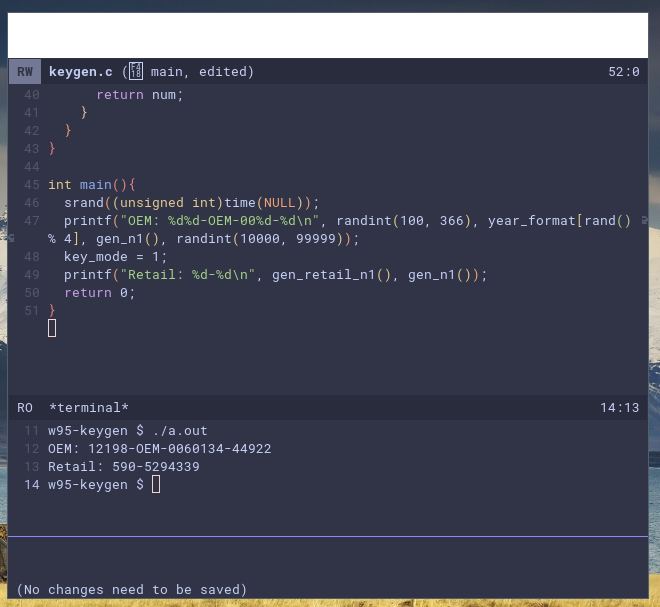

# .files
config files which i need.. this contains my emacs, vim, hyprland, dmenu and some other configs...

# emacs config:

> dependencies:
> - nano-modeline
> - catpuccin
> - git-gutter
> - git-gutter-fringe
> - corfu
> - marginalia
> - vertico
> - rainbow-delimeters
> - rainbow-mode
> - eglot

**NOTE:** tested on emacs 29..

# nvim config:

> dependencies:
> check init.lua
