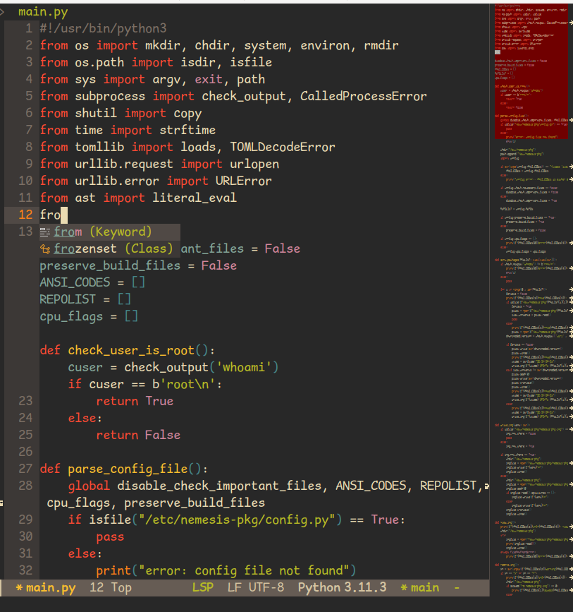

# .files
config files which i need.. this contains my emacs, vim, hyprland, dmenu and some other configs...

# emacs config:

> dependencies:
> - doom-modeline
> - lsp-mode
> - company
> - gruvbox-theme
> - minimap

# nvim config:

> dependencies:
> check init.lua
